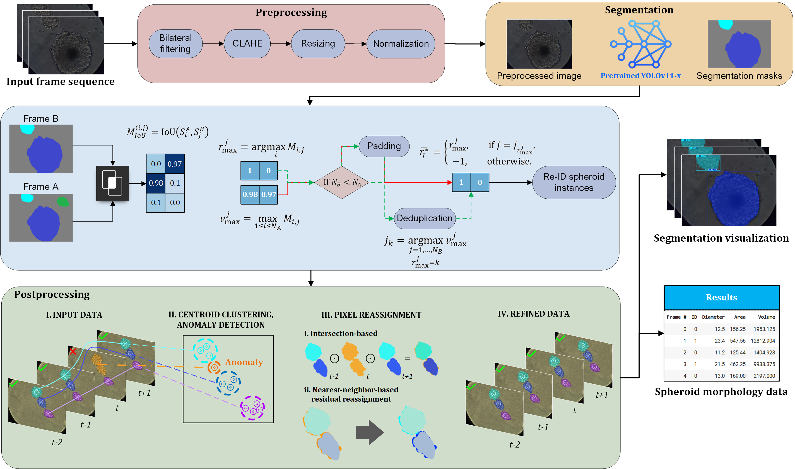
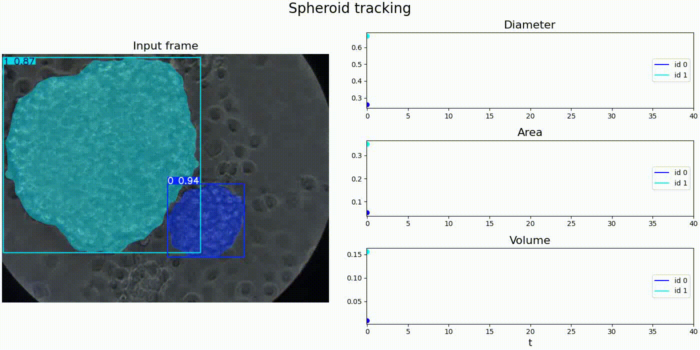

# REST: Resource-Efficient Spheroid Tracker

---

A lightweight deep-learning framework for automatic cell spheroid detection, segmentation and tracking in brightfield microscopy image sequences.

> 🚀 Built for brightfield microscopy, cryobiology, and scalable biomedical image analysis.

  
   
  <em>End-to-end pipeline schema</em>

## 🧭 Overview

This repository presents the **REST** (Resource-Efficient Spheroid Tracker) model - a computer-vision system for analyzing cell spheroid dynamics in time-lapse microscopy. The problem is scientifically important because spheroids are widely used in cryobiology and biomedical research to study dehydration, osmotic response, and the effect of cryoprotectants on cell viability and morphology. They are also actively utilized in **Personalized Medicine** - an actively developing area of research.

In practice, however, manual interpretation of microscopy sequences is slow, subjective, and difficult to scale. Our model addresses this challenge by combining:

- 🧠 a robust instance segmentation model for detecting spheroids in each frame;
- 🔗 a custom tracking-by-detection algorithm that preserves spheroid identity across time;
- ⚡ an efficient pipeline optimized for low-resource deployment and laboratory use.

The result is a system that is both accurate and practical: it provides continuous morphology measurements over time without requiring heavyweight infrastructure or complex motion-tracking assumptions.

### Why REST stands out

- ✅ High accuracy for spheroid segmentation and tracking
- 🧪 Tailored to cryoprotectant-induced morphological changes
- 📉 Low computational overhead for practical deployment
- 🧬 Scientifically meaningful for biomedical imaging workflows

---

## 🧪 Dataset

A customly created dataset of ~2,300 images was used for model training and evaluation. Ground truth instance segmentation labels were created using the SAM-2 model by MetaAI. For more information, please refer to our dataset publication at [BioImage Archive](https://www.ebi.ac.uk/biostudies/bioimages/studies/S-BIAD3778#o3).

*Samples of spheroid microimages*

---

## 📊 Evaluation and results

We thoroughly evaluate the model using a complete set of different quality metrics:
* Precision (P);
* Recall (R);
* F1-score (F1);
* Average Precision @ 50 (AP@50);
* Average Precision @ 50-95 (AP@50-95);
* Tracking Accuracy (TRA*);
* Peak RAM Utilization (PRU, measured in GB);
* Processing Time per Frame (PTpF, measured in seconds).

**note that we are using the TRA version described in Cell Tracking Challenge.*

As we can see, the model shows State-of-the-Art performance by all three aspects: segmentation quality, tracking quality, and resource efficiency. The table below shows the concrete values of each metric for both tested backbones, with **YOLO26x** being the clear leader.

| | P | R | F1 | AP@50 | AP@50-95 | TRA | PRU | PTpF |
| --- | --- | --- | --- | --- | --- | --- | --- | --- |
| YOLO11x | 91.1 | 88.8 | 89.9 | 90.7 | 87.1 | 87.9 | 1.42 | **4.18** |
| **YOLO26x** | **95.7** | **93.2** | **94.4** | **96.1** | **91.5** | **92.3** | **1.37** | 4.7 |

*Test model quality metrics*

Below is a real demonstration of the tracker's inference. On the left the frame sequence is depicted along with the visualized segmentation mask overlay. On the right the time series morphology plots are demonstrated, showing the dynamics of changes in spheroid diameter, area, and volume.

---

## ⚙️ Experimental setup

For training and evaluation, the project used:

- Python 3.10 / 3.11 environments
- deep learning and computer vision packages from the Ultralytics ecosystem
- Kaggle cloud infrastructure with a P100 16GB GPU for training and checkpointing
- local evaluation on an entry-level laptop device to measure resource consumption (hardware setup includes AMD Ryzen 5 CPU, 8 GB RAM, SSD).

The full environment configuration is available at `pyproject.toml`.

Model configurations are available in `yolo11x-seg.yaml` and `yolo26x-seg.yaml`. Please, use these files for proper setup of your model's training.

The resulting **REST** model is implemented step by step in `Tracker.ipynb`.

---

## Useful resources

To see how to train the segmentation model, please follow the link below.

For data labelling code, please refer to the repository below.

## Contributors & Contacts

The model was developed by [Ye. Ponomarov](https://orcid.org/0009-0006-5540-4282) and [S. Lytvynenko](https://orcid.org/0009-0007-6464-3231) under the supervision of [M. Tatariants](https://orcid.org/0000-0002-5952-9801) as part of the [CryoVision](https://github.com/EugenTheMachine/cryo-vision) project.

Should you have any questions, please, feel free to contact us via the e-mail: Yevhen.Ponomarov@cs.khpi.edu.ua.

*Note that we are not releasing the model weights publicly at the moment, so, please, contact us in case you would like to use it for your research.*
